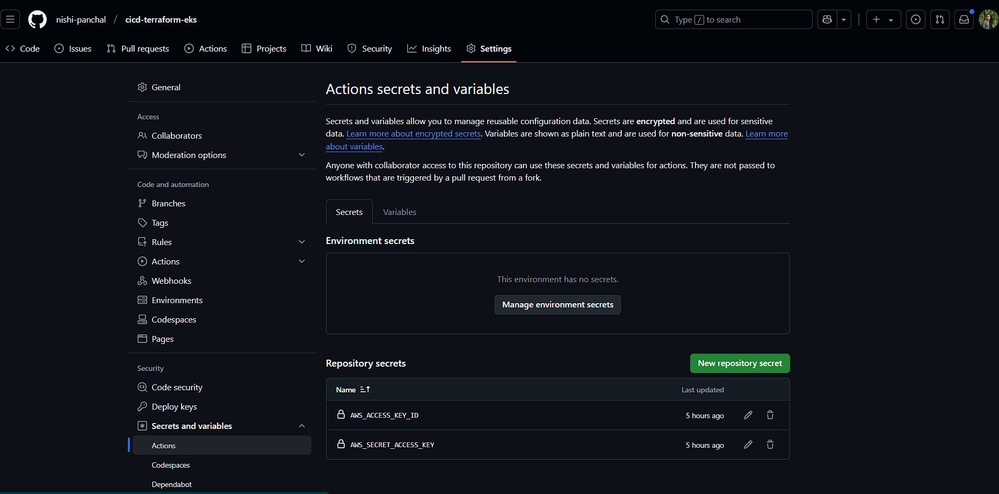

# CI/CD Pipeline with AWS EKS and Terraform

This project demonstrates a complete CI/CD pipeline using GitHub Actions to deploy a Next.js application to Amazon EKS (Elastic Kubernetes Service) with infrastructure managed by Terraform.

## Architecture
WIP

## Prerequisites

- AWS Account with appropriate permissions
- GitHub Account
- AWS CLI installed and configured
- Terraform installed (v1.0+)
- kubectl installed
- Docker installed

## Project Structure
```
project-root/
├── .github/
│ └── workflows/
│ └── deploy.yml
├── terraform/
│ ├── bootstrap/
│ │ ├── main.tf
│ │ ├── variables.tf
│ │ └── outputs.tf
│ ├── main.tf
│ ├── variables.tf
│ ├── outputs.tf
│ ├── ecr.tf
│ ├── eks.tf
│ └── vpc.tf
├── k8s/
│ └── deployment.yml
├── app/
│ └── page.js
├── Dockerfile
└── next.config.mjs
```

## Step-by-Step Setup Guide

### 1. Initial Setup

1. Clone this repository
2. Configure AWS credentials locally:
   ```bash
   aws configure
   ```
3. Create GitHub repository and push code
4. Add AWS credentials to GitHub Secrets:
   - AWS_ACCESS_KEY_ID
   - AWS_SECRET_ACCESS_KEY



### 2. Bootstrap Infrastructure

1. Initialize and apply bootstrap configuration:
   ```bash
   cd terraform/bootstrap
   terraform init
   terraform plan
   terraform apply
   ```
   This creates:
   - S3 bucket for terraform state
   - DynamoDB table for state locking


### 3. Main Infrastructure Deployment

1. Initialize main terraform configuration:
   ```bash
   cd ../
   terraform init
   terraform plan
   terraform apply
   ```
   This creates:
   - VPC and networking components
   - EKS cluster
   - ECR repository


### 4. Application Deployment

1. Configure kubectl for EKS:
   ```bash
   aws eks update-kubeconfig --name cicd-terraform-eks-cluster --region us-east-1
   ```

2. Push code to main branch to trigger GitHub Actions pipeline:
   ```bash
   git add .
   git commit -m "Initial application deployment"
   git push origin main
   ```


## Testing the Deployment

1. Check EKS pods and services:
   ```bash
   kubectl get pods
   kubectl get svc cicd-terraform-eks-service
   ```

2. Access the application:
   - Get the LoadBalancer URL from the service output
   - Open in browser: http://<LOADBALANCER_URL>

3. Verify AWS resources:
   - Check ECR for Docker images
   - Check EKS for running pods
   - Check EC2 for running nodes


## Resource Cleanup

To avoid unnecessary AWS charges, clean up resources when done:

1. Delete Kubernetes resources:
   ```bash
   kubectl delete -f k8s/deployment.yml
   ```

2. Destroy terraform resources:
   ```bash
   # In main terraform directory
   terraform destroy

   # In bootstrap directory
   cd bootstrap
   terraform destroy
   ```

3. Additional cleanup:
   - Delete ECR images
   - Remove GitHub Secrets if needed

## Common Issues and Solutions

1. **Docker Build Fails**:
   - Verify Dockerfile configuration
   - Check next.config.mjs settings

2. **EKS Connection Issues**:
   - Verify AWS credentials
   - Check VPC and subnet configuration
   - Ensure security group settings

3. **GitHub Actions Failures**:
   - Verify GitHub Secrets
   - Check workflow file syntax
   - Ensure proper IAM permissions

